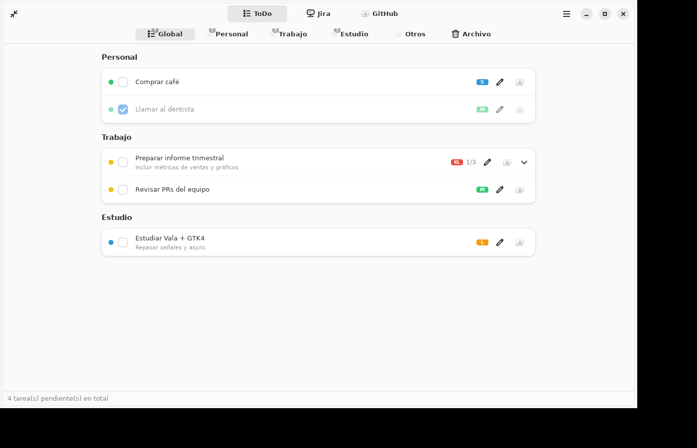

# Categorized ToDo — edición GTK 4 / libadwaita (Vala)

Aplicación de escritorio para **Ubuntu 24.04** que reimplementa, en **GTK 4 +
libadwaita** con **Vala**, el plasmoide de KDE *Categorized ToDo*. Combina tres
modos en una sola app:

- **ToDo** — lista de tareas local con hasta **7 categorías**, subtareas,
  prioridades (XS/S/M/L/XL), archivo, expandir/contraer todo, e
  **importación/exportación** por categoría. Opcionalmente **sincroniza en dos
  sentidos con Notion** y permite **anexar cada tarea a una subtarea de Jira**.
- **Jira** — vista de solo lectura de las incidencias que devuelve tu consulta
  **JQL** (Jira Cloud REST v3), agrupadas en hasta **10 categorías**
  configurables, con **barra de horas consumidas** por tarjeta y **cambio de
  estado** (clic derecho → transiciones). Al hacer clic se abre su detalle
  (descripción + comentarios + cambiar estado).
- **GitHub Projects** — vista de solo lectura de un **Projects (V2)** vía la API
  GraphQL v4, agrupada en hasta **4 categorías** configurables.

Se ejecuta de dos formas a la vez:

1. Como **ventana de escritorio** completa (tamaño configurable).
2. Como **ventanita** tipo *widget momentáneo* que se abre desde un **icono en
   la barra superior** (bandeja / *StatusNotifierItem*): sin barra de título y
   se **cierra sola al clickear afuera** (como el panel del calendario de
   GNOME). Por defecto mide **1000×700** y su tamaño, escala, autocierre y
   marco son **parametrizables**. Incluye un botón para **abrir la app
   completa**.

La app **sigue corriendo en segundo plano** cuando cerrás la ventana desde el
dock. Para **cerrarla del todo** hacé **clic derecho en el icono de la barra**
y elegí **«Salir»** (o usá el menú ☰ → Salir dentro de la app).



---

## Requisitos

Ubuntu 24.04 (GNOME por defecto). Para ver el **icono en la barra superior** se
necesita el soporte de bandeja *StatusNotifierItem / AppIndicator*, que en
Ubuntu viene con la extensión **«Ubuntu AppIndicators»** (activada de fábrica en
la sesión *Ubuntu*). En GNOME puro, instalá la extensión *AppIndicator and
KStatusNotifierItem Support*. En KDE Plasma funciona sin nada extra.

Dependencias de compilación (las instala `install.sh`):

```
valac meson ninja-build build-essential pkg-config
libgtk-4-dev libadwaita-1-dev libsoup-3.0-dev
libjson-glib-dev libsqlite3-dev libgee-0.8-dev
```

## Instalación

```bash
cd gtk-app
./install.sh              # instala en ~/.local (sin sudo)
./install.sh --system     # instala en /usr (usa sudo)
./install.sh --run        # compila, instala y ejecuta
./install.sh --uninstall  # desinstala
./install.sh --no-deps    # omite el chequeo de dependencias apt
```

`install.sh` envuelve **Meson/Ninja**. También podés hacerlo a mano:

```bash
meson setup build --prefix ~/.local
ninja -C build
ninja -C build install
```

Después de instalar en `~/.local`, asegurate de tener `~/.local/bin` en tu
`PATH`. Lanzá con `categorized-todo` o desde el menú de aplicaciones
(«Categorized ToDo»).

### Línea de comandos

```
categorized-todo             # abre la ventana principal
categorized-todo --popup     # abre/cierra la ventanita de la bandeja
categorized-todo --background # arranca solo en segundo plano (bandeja)
categorized-todo --quit      # cierra la instancia en ejecución
categorized-todo --version
```

## Uso

- Cambiá de modo (**ToDo / Jira / GitHub**) con el selector del encabezado.
- En **ToDo**, cada categoría es una pestaña; **Global** muestra todo junto y
  **Archivo** las tareas completadas y archivadas. El botón **+** de cada
  categoría crea una tarea; el lápiz la edita (incluidas subtareas); el botón de
  tilde la archiva.
- Configurá todo en **☰ → Preferencias** (o `Ctrl+,`): modo, categorías,
  credenciales de Jira/GitHub/Notion, tamaño de las ventanas, escala de la
  ventanita, y el comportamiento de bandeja / segundo plano.

## Configuración y almacenamiento

- La **configuración** se guarda con **GSettings** (esquema
  `io.github.categorizedtodo`, backend *dconf*).
- Las **tareas** viven en **SQLite** en
  `~/.local/share/categorized-todo/todo.sqlite`. Jira y GitHub cachean su última
  respuesta en la misma base para poblar la UI al instante.

Detalles por tema:

- [`docs/JIRA.md`](docs/JIRA.md) — credenciales, JQL y categorías de Jira.
- [`docs/GH_PROJECTS.md`](docs/GH_PROJECTS.md) — token, proyecto y categorías de GitHub.
- [`docs/NOTION.md`](docs/NOTION.md) — sincronización bidireccional con Notion.
- [`docs/PERSISTENCE.md`](docs/PERSISTENCE.md) — dónde vive cada cosa y cómo respaldarla.
- [`docs/TRAY.md`](docs/TRAY.md) — el icono de la barra y el segundo plano.
- [`docs/ARCHITECTURE.md`](docs/ARCHITECTURE.md) — estructura del código.

## Licencia

GPL-3.0-or-later.
